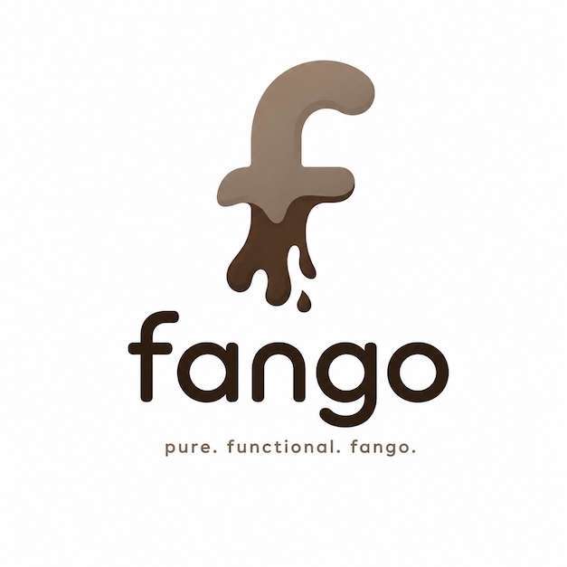

<p align="center">
  
</p>

# fango

fango is an experimental, strict, statically typed, purely functional
programming language inspired by Elm and Haskell. It combines whole-program
type inference, algebraic data types and pattern matching, type classes, and
direct-style algebraic effects, then compiles programs to Go.

The implementation is deliberately small: a Go toolchain, local source
modules, a bundled experimental standard library, and generated programs that
stay close to ordinary Go.

## Try it

fango requires Go 1.26. Build the compiler, then run a program:

```sh
make
./fango run examples/guess.fango
```

For the language and project details, see the
[language reference](doc/reference.md), [design](doc/design.md), and
[roadmap](doc/roadmap.md). More runnable programs live in
[examples](examples/).
